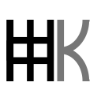

# kakoune-wiki



Personal wiki plugin for [**Kakoune**](http://kakoune.org/)

## Motivation

Personal wiki is collection of interconnected notes you can store your
knowledge in. I wanted to create plugin for Kakoune that would make creating
such wiki as hassle-free as possible. My main issue was manual creation of
new pages and writing Markdown links by hand. When I've got an idea I want
to write it down right now, without navigating file system.  I want to be
able to create and link other notes during writing as well.

## Features

- find and edit any page using wiki command, no matter where you are in
the file system
- quickly jump between wiki pages. Just point on link and press enter
- create interconnected pages with `@pagename` syntax that expands to standard Markdown links
- toggle Markdown check-boxes with `<ret>` key in normal mode
- wiki is just bunch of Markdown files, you can process/edit them further
with tools like [pandoc](https://pandoc.org/),
[MdWiki](http://dynalon.github.io/mdwiki/),
[markor](https://github.com/gsantner/markor) or any text editor. No vendor lock-ins
- minimal and simple — only essential features, script around 100 LOC

## Installation

You can either:

- load `wiki.kak` from your `kakrc`: `source path/to/wiki.kak`
- put `wiki.kak` in your autoloads directory `~/.config/kak/autoload/`

Then you have to choose directory for your wiki. Call following command from
your kakrc:

```
wiki_setup "/home/user/my/wiki/directory"
```

**This plugin was tested on Kakoune v2018.04.13** on Linux. In case of any
problems feel free to open an issue. I do not support builds from Kakoune
master branch, **only last stable releases of Kakoune will be supported**.

## Usage

### Create new page

To create wiki page use `wiki` command. Provide file name as parameter:

```
wiki cookies.md
```

This command creates file `cookies.md` in your wiki directory. You can also use
subdirectories for organization purpose. To create new page in subdirectory:
```
wiki recipes/cookies.md
```

Note that path is always relative to the wiki root directory.

### Edit existing page

To edit wiki page use (you guessed it) `wiki` command. You can press `TAB` key for autocompletion:

```
wiki recipes/<TAB> # cycle through available pages
```

### Link pages

To reference other wiki page use `@+tag` syntax. Type `@+cookies<ret>` in insert
mode to create standard Markdown link to wiki page `cookies.md` in your wiki
directory. As alternative you can use `wiki_expand_tag` command in normal
mode when whole `@+tag` is selected.  You can use subdirectories as well,
path is always relative to **wiki root directory**, however expanded link
**will be relative to currently edited wiki page**:
If page referenced by `@tag` does not exist it will be created. Directories
will be created as well.

```
# editing recipes/cookies.md
@+chocolate<ret> 
expands to
[chocolate](../chocolate.md)
```

### Link pictures

You can create links to pictures just as easily - use `@!pic.png` format.
Picture links work the same as normal links. 

```
@!cute_kitteh.png<ret>
expands to

```

Picture files won't be created if not exist, but if you do have the picture, you can use the
next feature:

### Competation

Both link types are autocompleted from wiki folder. You need to type just the first two letter of tag
and a window with completions will pop up.


### Checkboxes

You can toogle Markdown checkboxes on and off using `<ret>` key in normal mode or `wiki_toogle_checkbox` command:

```
# TODO

- [ ] foo
- [ ] bar # press <ret>
- [X] bar # result

```

## Changelog 

- 0.1:
	- initial relese
- 0.2:
	- ADD toogle checkbox feature
- 0.3 2018-07-15:
	- ADD support for nested directories	
	- REMOVE hide wiki_new_page command, use wiki instead
	- CHANGE wiki command use relative paths now
